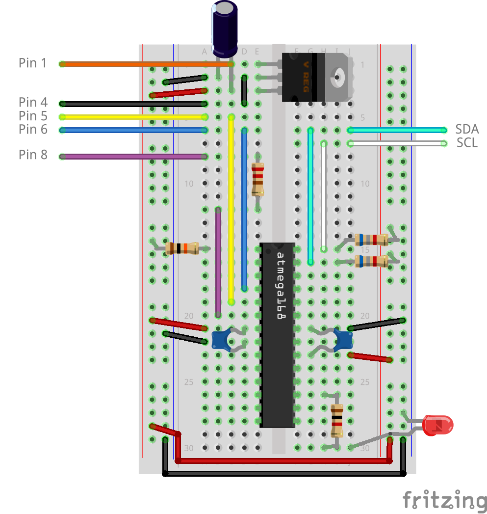

# Spaduino
Arduino sketch that let you talk to your Calspa controller over I2C

Tested on an ATmega328P running at 3.3V/8MHz. Works on a 2012 Cal Spa with a Balboa controller CS6200DV. Other Balboa based controller with "dumb" Top Side displays might work.

Flash your chip with this sketch. You need to connect wires similar to this:

For more information regarding the pins, see the [Cal Spa Connector](http://www.olivierhill.ca/archives/74-Cal-Spa-Connector.html)

I use this setup with a WiFi microcontroller to monitor the hot tub remotely using MQTT.
